<!-- ============================================================================== -->
<!-- 00. ANIMATED HERO DEV STATION (CYBER NEON AURORA EDITION)                      -->
<!-- ============================================================================== -->

  

<!-- Dynamic Typing SVG Banner -->

 

<!-- Interactive Quick-Nav Jump Pills -->

  
  
  
  
  
  
  
  
  

<!-- Prominent Featured Projects Live Link Banner Badges -->

  
  &nbsp;
  

<!-- High-Impact Live Badges -->

  
  &nbsp;
  
  &nbsp;
  
  &nbsp;
  
  &nbsp;
  
  &nbsp;
  

 

<!-- ============================================================================== -->
<!-- 01. PROFILE DOSSIER & ACADEMIC HUB                                             -->
<!-- ============================================================================== -->

## 📌 Profile Dossier &amp; Engineering Hub

  

 

<!-- Two-Column Interactive Layout: Hacker Terminal Bio & Animated Skill Bars -->
<table width="100%">
  <tr>
    <td width="50%" valign="top">
      
    </td>
    <td width="50%" valign="top">
      
    </td>
  </tr>
</table>

 

I am **Chowreddygari Gnanendra Reddy**, a high-velocity 3rd-year Computer Science undergraduate at **Vel Tech Rangarajan Dr. Sagunthala R&D Institute of Science and Technology, Chennai** (`VTU29661`, Reg No: `24UECS0503`). I design and build end-to-end mission-critical digital systems spanning **responsive full-stack web applications**, **production-grade Java backend architectures**, and **real-time embedded IoT hardware telemetry streams**.

- 🎓 **Academic Orbit:** 3rd-Year B.Tech in CSE at **Vel Tech University, Chennai** (2024–2028, CGPA: 8.6/10), maintaining consistent academic excellence across data structures, algorithm optimization, computer architecture, and object-oriented design patterns.
- 🚀 **Full-Stack Web Engineering:** Architecting fluid, reactive digital experiences with **React 19**, **Next.js**, **TypeScript**, **JavaScript (ES6+)**, **Node.js**, **Express.js**, and **Tailwind CSS**, prioritizing clean component modularity, instant routing, and 60 FPS transitions.
- ☕ **Core Java & Algorithmic Suites:** Grounded in **Java 21**, Object-Oriented Principles (SOLID), clean modular design, unit-tested DSA suites, and automated testbench verification.
- ⚡ **Smart Embedded IoT:** Hands-on designer of sensor acquisition pipelines, vehicular road safety collision radar, and biomedical telemetry streams engineered on **Arduino C++** and high-speed serial protocols.
- 🎖️ **IIT / NPTEL Elite Classification:** Formally credentialed in **Industry 4.0 and Industrial Internet of Things (IIoT)** with an **Elite** classification by IIT Kharagpur & Ministry of Education.

 

<!-- ============================================================================== -->
<!-- 02. TECH ARSENAL & SYSTEM ARCHITECTURE                                         -->
<!-- ============================================================================== -->

## 🛠️ Tech Arsenal &amp; System Architecture

  

 

| Domain | Core Technologies &amp; Frameworks | Applied Proficiency &amp; Architectural Focus |
| :--- | :--- | :--- |
| **Languages** | Java 21, JavaScript (ES6+), TypeScript, Python 3, C, HTML5, CSS3, SQL | Object-Oriented Architecture, Async Streams, Data Structures &amp; Algorithms |
| **Frontend Engineering** | React 19, Next.js, Tailwind CSS, Glassmorphic UI/UX, Responsive Layouts | 60 FPS Fluid Transitions, Micro-Animations, Component Modularity, SPA Architecture |
| **Backend &amp; APIs** | Node.js, Express.js, RESTful Architecture, JWT Authentication, JSON Schemas | Middleware Pipelines, Route Protection, Secure Sessions, Fair-Wage Remittance |
| **IoT &amp; Embedded Systems** | Arduino C++, Optical Pulse Sensors, Ultrasonic Sonar, Serial Telemetry Hubs | Analog Signal Filtering, Real-Time Sensor Telemetry, Edge Alerting, IIoT 4.0 Protocols |
| **Databases &amp; Storage** | MySQL, PostgreSQL, MongoDB, Relational Modeling, Index Optimization | ACID Compliance, Schema Normalization, Document Datastores, Audit Trail Ledgers |
| **DevOps &amp; Engineering Tools** | Git, GitHub, GitHub Actions (CI/CD), Docker, Linux / Bash, Postman, VS Code | Automated Workflows, Continuous Deployment, Version Control, Pipeline Automation |

 

  

 

<!-- ============================================================================== -->
<!-- 03. FEATURED LIVE WEB PROJECT 1                                                -->
<!-- ============================================================================== -->

## 🏛️ Featured Live Project 1: Tamil Nadu Tourism

  

  
  &nbsp;
  
  &nbsp;
  
  &nbsp;
  
  &nbsp;
  

 

> 💡 **Live Interactive Web Application:** [gnanendra942.github.io/TAMILNADU-TOURISM-](https://gnanendra942.github.io/TAMILNADU-TOURISM-/)  
> **Key Highlights:** An editorial-grade travel discovery portal engineered with **zero external dependencies**, **60 FPS fluid micro-interactions**, an **algorithmic dynamic tour planner**, and an interactive vector map spanning 12 living heritage, coastal, and hill station circuits.

 

<b>🔍 Architectural Deep Dive — Tamil Nadu Tourism Platform</b>

 

> **Engineering Highlights:**
> - **Architecture:** High-performance single-page application built with pure HTML5 semantic structure, CSS3 custom properties, and vanilla ES6+ JavaScript.
> - **Zero Dependencies:** No React, Vue, jQuery, Tailwind, or external runtime libraries. Instant load times and optimal Lighthouse performance.
> - **Smart Algorithmic Trip Planner:** Dynamic client-side scoring calculating optimal travel duration (3, 5, 7, 10 days), pace calibration, and interest vector clustering.
> - **Interactive Vector Mapping:** Geographic breakdown across 5 distinct zones (North, South, Central, West, Delta) covering 12 living heritage, coastal, and hill station circuits.
> - **Continuous Delivery:** Automated GitHub Actions workflow targeting **GitHub Pages** deployment at [gnanendra942.github.io/TAMILNADU-TOURISM-](https://gnanendra942.github.io/TAMILNADU-TOURISM-/).

 

<!-- ============================================================================== -->
<!-- 04. FEATURED LIVE WEB PROJECT 2                                                -->
<!-- ============================================================================== -->

## 🛍️ Featured Live Project 2: Women’s Empowerment Marketplace

  

  
  &nbsp;
  
  &nbsp;
  
  &nbsp;
  
  &nbsp;
  

 

> 💡 **Live Interactive Web Application:** [gnanendra942.github.io/Women-s-Empowerment-Marketplace](https://gnanendra942.github.io/Women-s-Empowerment-Marketplace/)  
> **Key Highlights:** An end-to-end full-stack digital commerce and artisan empowerment ecosystem engineered to eliminate intermediary commissions for self-employed rural women artisans. Features a high-converting modern storefront, cryptographic artisan provenance verification, dynamic cart & checkout workflows, verified seller analytics suite, and fair-wage direct remittance.

 

<b>🔍 Architectural Deep Dive — Women’s Empowerment Marketplace</b>

 

> **Problem Solved:** Traditional commercial e-commerce platforms levy prohibitive 20–35% listing commissions and enforce complex logistics that marginalize independent women artisans and rural cottage craft collectives.
> 
> **Key Engineering & Architectural Highlights:**
> - **Frontend & Client Architecture:** High-performance responsive web application built with React, Tailwind CSS, and zero-latency standalone SPA architecture. Includes ShopClues-inspired multi-category deals grid, interactive product image magnifier, artisan impact stories, real-time coupon engine, and order status stepper.
> - **Artisan Provenance Engine:** Cryptographic batch and artisan identity ledger tracking craft origin, creation hours, fair-wage direct payout transparency, and authentic GI-tag certifications.
> - **Backend & REST APIs:** Modular Express.js REST API with JWT role-based access control (RBAC), securing separate seller administrative dashboards, stock replenishment streams, and customer orders.
> - **Database & Modeling:** Scalable MongoDB collections indexing dynamic handicraft catalogs, artisan workshop bookings, transaction audits, and seller rating telemetry.
> - **Security & Hardening:** Token-based authentication, salted cryptographic credential hashing, parameterized payload sanitization, and CORS-restricted endpoint protection.
> - **Continuous Delivery & Hosting:** Deployed and publicly accessible on **GitHub Pages** at [gnanendra942.github.io/Women-s-Empowerment-Marketplace](https://gnanendra942.github.io/Women-s-Empowerment-Marketplace/).

 

<!-- ============================================================================== -->
<!-- 05. SYSTEMS, IOT & ALGORITHMIC ENGINEERING                                     -->
<!-- ============================================================================== -->

## 💡 Systems, IoT &amp; Algorithmic Engineering

<!-- 2x2 Project Showcase Grid -->
<table width="100%">
  <tr>
    <td width="50%" valign="top">
      
    </td>
    <td width="50%" valign="top">
      
    </td>
  </tr>
  <tr>
    <td width="50%" valign="top">
      
    </td>
    <td width="50%" valign="top">
      
    </td>
  </tr>
</table>

 

<!-- ============================================================================== -->
<!-- 06. CERTIFICATIONS & ACADEMIC DISTINCTIONS                                     -->
<!-- ============================================================================== -->

## 📜 Certifications &amp; Academic Distinctions

  

 

| Qualification / Credential | Institution / Issuer | Classification &amp; Score | Key Focus Areas |
| :--- | :--- | :--- | :--- |
| **Introduction to Industry 4.0 &amp; IIoT** | **NPTEL / IIT** (Ministry of Education, Govt. of India) | 🎖️ **Elite** (Score: 64/100) | Industrial IoT, Cyber-Physical Systems, Embedded Sensors &amp; Smart Automation |
| **B.Tech Computer Science &amp; Engineering** | **Vel Tech R&amp;D Institute of Science &amp; Technology**, Chennai | 🎓 **CGPA: 8.6 / 10** (Class of '28) | Data Structures, Java OOP, Full-Stack Architecture, Operating Systems, ACS |
| **Intermediate (MPC - Maths, Physics, Chem)** | **Sri Chaitanya Junior College**, Andhra Pradesh | 🏛️ **Score: 8.51 / 10 (85.1%)** | Advanced Mathematics, Analytical Problem Solving, Scientific Computing |

 

<!-- ============================================================================== -->
<!-- 07. GITHUB ANALYTICS & LIVE SYSTEM STATE                                       -->
<!-- ============================================================================== -->

## 📊 GitHub Analytics &amp; Live System State

<!-- Dynamic Animated Status Badge -->

  

<!-- 2x2 Bento Analytics Grid -->
<table width="100%">
  <tr>
    <td width="50%" valign="top">
      
    </td>
    <td width="50%" valign="top">
      
    </td>
  </tr>
  <tr>
    <td width="50%" valign="top">
      
    </td>
    <td width="50%" valign="top">
      
    </td>
  </tr>
</table>

 

<!-- Contribution Snake -->

 

<!-- ============================================================================== -->
<!-- 08. VERIFIED ACHIEVEMENTS, TROPHIES & GRAPH                                    -->
<!-- ============================================================================== -->

## 🏆 Verified Achievements, Trophies &amp; Activity Graph

<!-- Animated Trophies Card -->

  

<!-- Animated Contribution Velocity Graph -->

 

<!-- ============================================================================== -->
<!-- 09. CONNECT & FOOTER                                                           -->
<!-- ============================================================================== -->

## 📬 Let's Connect &amp; Collaborate

I am actively open to software engineering internships, open-source collaborations, full-stack web roles, and IoT research opportunities. Let’s build something impactful together.

 

  
  &nbsp;
  

<!-- Direct Featured Live Projects Launch Banners -->

  
  &nbsp;
  

 

> ⚡ *"Simplicity and precision in code; resilience, speed, and elegance in architecture."*

 

<!-- Animated Cyber Footer -->

