  

  

  
  
  

  
  
  
  

  

<h2 align="center">Building clean products with purpose</h2>

  I’m <b>Chowreddygari Gnanendra Reddy</b>, a Computer Science Engineer focused on creating reliable, scalable, and user-centric digital products. I enjoy turning complex ideas into elegant software solutions that are practical, maintainable, and valuable in real life.

  
  

## About Me

I am a Computer Science graduate with a strong interest in backend engineering, full-stack development, system design, and problem solving. My work focuses on building modern web applications, improving product experience, and writing clean, scalable code with real-world impact.

I enjoy learning and working across the stack, from frontend interfaces to server logic, database design, and deployment workflows. I’m especially driven by projects that combine usability, performance, and thoughtful engineering.

  

## Tech Stack

### Languages

### Frontend

### Backend

### Databases

### Tools & DevOps

## Featured Projects

  <table>
    <tr>
      <td width="50%" valign="top">
        

          <h3>Women Entrepreneur Marketplace</h3>
          
A responsive marketplace platform designed to help women-led businesses showcase and sell products online.

          
<strong>Stack:</strong> React, Node.js, Express, MongoDB

          

            
          

          

            <a href="https://github.com/Gnanendra942/women-marketplace" target="_blank">Repository</a> •
            <a href="https://example.com/demo-marketplace" target="_blank">Demo</a>
          

        

      </td>
      <td width="50%" valign="top">
        

          <h3>Road Safety Project</h3>
          
A research-driven safety initiative focused on accident prevention insight and real-world awareness.

          
<strong>Stack:</strong> JavaScript, HTML, CSS, Analytics

          

            
          

          

            <a href="https://github.com/Gnanendra942/road-safety-project" target="_blank">Repository</a> •
            <a href="https://example.com/demo-road-safety" target="_blank">Demo</a>
          

        

      </td>
    </tr>
    <tr>
      <td width="50%" valign="top">
        

          <h3>Pulse Monitoring System</h3>
          
A health-tech prototype for monitoring pulse readings and visualizing trends in real time.

          
<strong>Stack:</strong> Embedded Systems, Sensor Data, JavaScript

          

            
          

          

            <a href="https://github.com/Gnanendra942/pulse-rate-monitor" target="_blank">Repository</a> •
            <a href="https://example.com/demo-pulse" target="_blank">Demo</a>
          

        

      </td>
      <td width="50%" valign="top">
        

          <h3>Developer Portfolio Dashboard</h3>
          
A polished dashboard concept built to present projects, metrics, and developer identity professionally.

          
<strong>Stack:</strong> React, Tailwind CSS, UI Design

          

            
          

          

            <a href="https://github.com/Gnanendra942/portfolio-dashboard" target="_blank">Repository</a> •
            <a href="https://example.com/demo-dashboard" target="_blank">Demo</a>
          

        

      </td>
    </tr>
  </table>

## GitHub Stats

  
  

  

  

## Education

  <table>
    <tr>
      <td width="50%" valign="top">
        

          <h3>Vel Tech, Chennai</h3>
          
<strong>B.Tech in Computer Science Engineering</strong>

          
2020 - 2024

        

      </td>
      <td width="50%" valign="top">
        

          <h3>Learning Focus</h3>
          
Full-stack development, system design, UI engineering, and product-oriented problem solving.

        

      </td>
    </tr>
  </table>

## Contact

  
  
  

  

  <i>“Clean code, thoughtful design, and purposeful product building.”</i>

  <i>Last updated: 2026-08-30</i>

