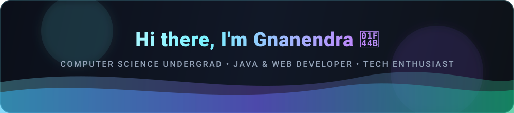
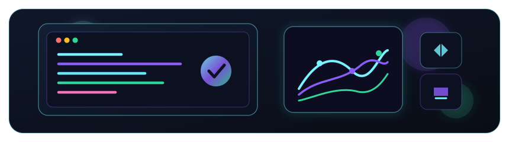
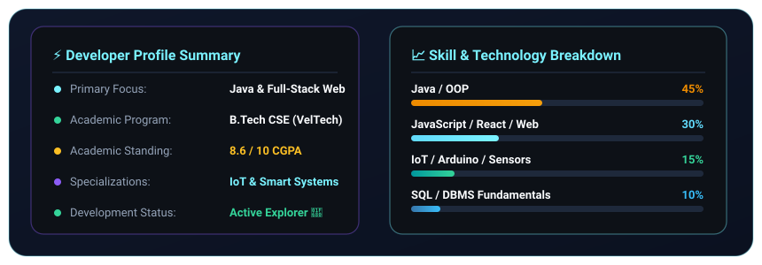
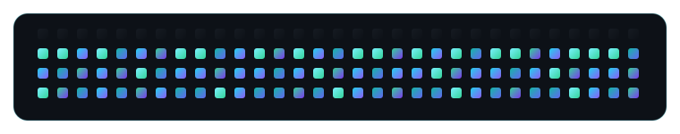

  

  

  
  
  
  
  

 

  
  
  

 

<!-- Developer Workspace Illustration -->

  

 

<!-- About Section -->
## 👨‍💻 About Me

  Hello! I’m <b>Chowreddygari Gnanendra Reddy</b> (often known as <b>Gnanu</b>), a passionate <b>Computer Science Undergraduate</b> at <b>VelTech University</b>, Chennai. I love building practical software applications, exploring cutting-edge developer tools, and solving complex algorithmic challenges. My core technical strengths revolve around <b>Java, Object-Oriented Design, and Full-Stack Web Development</b>, backed with hands-on experience in <b>IoT / Embedded Systems</b>.

### 📌 Quick Highlights

| 🎓 **Degree** | B.Tech in Computer Science & Engineering |
|:---|:---|
| 🏫 **University** | VelTech Rangarajan Dr. Sagunthala R&D Institute of Science and Technology |
| 📊 **Current CGPA** | **8.6 / 10** |
| 🆔 **VTU & Reg No** | `VTU29661` &bull; `24UECS0503` |
| 📍 **Location** | Avadi, Chennai, Tamil Nadu, India |
| 🎯 **Current Focus** | Advanced Java, Data Structures, Modern React & Full-Stack Architectures |

 

---

<!-- Tech Stack Section -->
## 🛠️ Tech Stack & Skills

### 💻 Programming Languages

  
  
  
  
  

### 🌐 Frontend & Web Technologies

  
  
  
  
  

### 🗄️ Database & Storage

  
  
  

### 🔧 Tools, Hardware & Platforms

  
  
  
  
  
  

### 🧠 Core Concepts

  
  
  
  

 

---

<!-- Featured Projects -->
## 🚀 Featured Projects

<table>
  <tr>
    <td width="33%" valign="top">
      <h3>🚗 Road Safety & Prevention</h3>
      
<b>Intelligent Curved Road Safety System</b>

      
A smart infrastructure concept designed for sharp mountain bends and blind curves. Employs speed tracking, sensor telemetry, and automatic hazard warning signals to prevent collisions.

      

        
        
      

    </td>
    <td width="33%" valign="top">
      <h3>💓 Pulse Rate Monitor</h3>
      
<b>IoT & Biomedical Sensor Solution</b>

      
An embedded health-tech device utilizing Arduino and optical pulse sensors for continuous BPM acquisition, signal filtering, visual pulse status, and real-time telemetry output.

      

        
        
      

    </td>
    <td width="33%" valign="top">
      <h3>🛍️ Women’s Marketplace</h3>
      
<b>Full-Stack E-Commerce Platform</b>

      
A modern digital marketplace platform designed to empower women entrepreneurs and artisans by showcasing handcrafted merchandise, streamlining inventory, and boosting local sales.

      

        
        
      

    </td>
  </tr>
</table>

 

---

<!-- Developer Analytics & Metrics -->
## 📊 Developer Analytics & Metrics

  

 

<!-- Contribution Rhythm -->
<h3 align="center">⚡ Contribution Rhythm</h3>

  

 

---

<!-- Education -->
## 🎓 Education & Qualifications

| Institution | Degree / Course | Details / Grades |
|:---|:---|:---|
| **VelTech Rangarajan Dr. Sagunthala R&D Institute of Science and Technology** | **B.Tech in Computer Science and Engineering** | **CGPA: 8.6 / 10**   📍 Avadi, Chennai |
| **Sri Chaitanya Junior College** | **Intermediate (MPC - Maths, Physics, Chemistry)** | **Score: 8.51 / 10** |

 

---

<!-- Soft Skills & Languages -->
## 🌟 Soft Skills & Spoken Languages

### Soft Skills

  
  
  
  
  

### Spoken Languages

  
  
  

 

---

<!-- Connect With Me -->
## 🤝 Let's Connect!

  
I am always enthusiastic about collaborating on projects, discussing software architecture, or exploring new tech!

  
  
  

 

  

  

  

