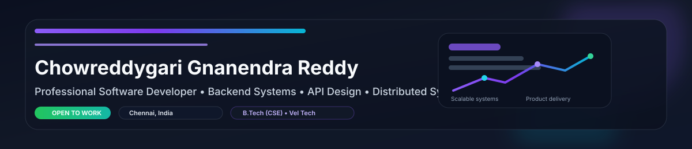

  

  <strong>Chowreddygari Gnanendra Reddy</strong> 
  Professional Software Developer • Backend Systems • API Design • Distributed Systems • Performance • Observability

  
  
  

  
  
  

  

## About
Professional software developer focused on building reliable, scalable, and user-centric products. I work across backend engineering, full-stack development, system design, and deployment with a product-minded, execution-first approach.

- Location: Chennai, India
- Education: B.Tech in Computer Science Engineering — Vel Tech, Chennai
- Contact: gnanendrareddy19@gmail.com

## Tech Stack

  
  
  
  
  

  
  
  
  
  

  
  
  
  
  

  

## Featured Projects
- Women Entrepreneur Marketplace — React, Node.js, Express, MongoDB  
  Repository: https://github.com/Gnanendra942/women-marketplace
- Road Safety Project — JavaScript, HTML, CSS, Analytics  
  Repository: https://github.com/Gnanendra942/road-safety-project
- Pulse Monitoring System — Embedded Systems, Sensor Data, JavaScript  
  Repository: https://github.com/Gnanendra942/pulse-rate-monitor
- Developer Portfolio Dashboard — React, Tailwind CSS, UI Design  
  Repository: https://github.com/Gnanendra942/portfolio-dashboard

  

## GitHub & Activity

  
  

## Contact
- Email: gnanendrareddy19@gmail.com  
- LinkedIn: Available on request  
- GitHub: https://github.com/Gnanendra942

<footer align="center">
  Clean code, thoughtful design, purposeful products. • Last updated: 2026-09-02
</footer>
