

<!-- ============================================================================== -->
<!-- 00. ANIMATED HERO DEV STATION -->
<!-- ============================================================================== -->

<a href="https://github.com/Gnanendra942">
  
</a>

  

<!-- Dynamic Typing SVG Banner -->

 

<!-- Interactive Quick-Nav Jump Pills -->

  
  
  
  
  
  
  

<!-- High-Impact Live Badges -->

  
  &nbsp;
  
  &nbsp;
  
  &nbsp;
  
  &nbsp;
  
  &nbsp;
  

 

<!-- ============================================================================== -->
<!-- 01. ABOUT ME & ACADEMIC HUB -->
<!-- ============================================================================== -->

## 📌 About Me

  

 

I am **Chowreddygari Gnanendra Reddy**, a 3rd-year Computer Science undergraduate at **Vel Tech Rangarajan Dr. Sagunthala R&D Institute of Science and Technology, Chennai** (`VTU29661`, Reg No: `24UECS0503`). I engineer end-to-end digital solutions spanning **responsive full-stack web applications**, **robust Java backend architectures**, and **real-time embedded IoT hardware telemetry systems**.

- 🎓 **Academic Orbit:** 3rd-Year B.Tech in CSE at **Vel Tech University** (2024–2028), maintaining consistent excellence across algorithms, data structures, and computer organization.
- 🚀 **Full-Stack Web Engineering:** Architecting fluid, component-driven web apps with **React 19**, **Next.js**, **TypeScript**, **JavaScript (ES6+)**, **Node.js**, **Express.js**, and **Tailwind CSS**.
- ☕ **Core Java & Algorithmic Design:** Grounded in **Java 21**, Object-Oriented Programming (OOP), design patterns, and unit-tested DSA suites with verifiable test automation.
- ⚡ **Smart Embedded IoT:** Hands-on designer of sensor acquisition pipelines, biomedical telemetry streams, and vehicular road safety devices built on **Arduino C++** and serial communication protocols.

 

<!-- ============================================================================== -->
<!-- 02. TECH STACK & ARSENAL -->
<!-- ============================================================================== -->

## 🛠️ Tech Stack & Arsenal

  

 

| Domain | Core Technologies & Frameworks | Applied Proficiency |
| :--- | :--- | :--- |
| **Languages** | Java 21, JavaScript (ES6+), TypeScript, Python 3, C, HTML5, CSS3, SQL | Object-Oriented Architecture, Async Streams, Data Structures |
| **Frontend Engineering** | React 19, Next.js, Tailwind CSS, Glassmorphic UI/UX, Responsive Layouts | 60 FPS Fluid Transitions, Micro-Animations, Component Modularity |
| **Backend & APIs** | Node.js, Express.js, RESTful Architecture, JWT Authentication, JSON Schemas | Middleware Pipelines, Route Protection, Secure Sessions |
| **IoT & Embedded Systems** | Arduino C++, Optical Pulse Sensors, Ultrasonic Sonar, Serial Telemetry Hubs | Analog Signal Filtering, Real-Time Sensor Telemetry, Edge Alerting |
| **Databases & Storage** | MySQL, PostgreSQL, MongoDB, Relational Modeling, Index Optimization | ACID Compliance, Schema Normalization, Document Datastores |
| **DevOps & Engineering Tools** | Git, GitHub, GitHub Actions (CI/CD), Docker, Linux / Bash, Postman, VS Code | Automated Workflows, Continuous Deployment, Version Control |

 

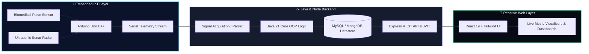

 

<!-- ============================================================================== -->
<!-- 03. FLAGSHIP PROJECT -->
<!-- ============================================================================== -->

## ⭐ Flagship Project

<a href="https://github.com/Gnanendra942">
  
</a>

 

<b>🔍 Architectural Deep Dive — Women’s Empowerment Marketplace</b>

 

> **Problem Solved:** Traditional marketplaces charge prohibitive listing commissions and create technical friction for self-employed women artisans and small village enterprises.
> 
> **Architectural Highlights:**
> - **Frontend:** Engineered with React and Tailwind CSS for lightning-fast responsive storefront catalog rendering.
> - **Backend:** Express.js REST API with JWT role-based access control protecting seller dashboards and customer orders.
> - **Database:** Structured MongoDB collections for dynamic inventories, transaction logs, and seller metric aggregation.
> - **Security:** Token-based authentication, salted cryptographic credential hashing, and parameterized query validation.

 

<!-- ============================================================================== -->
<!-- 04. FEATURED PROJECTS PORTFOLIO -->
<!-- ============================================================================== -->

## 💡 Featured Project Portfolio

<!-- 2x2 Project Showcase Grid -->
<table width="100%">
  <tr>
    <td width="50%" valign="top">
      <a href="https://github.com/Gnanendra942">
        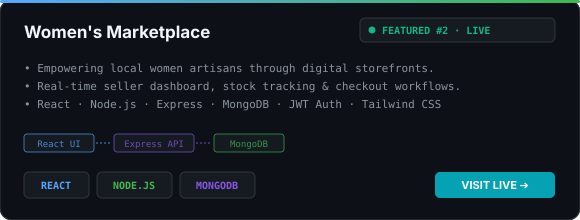
      </a>
    </td>
    <td width="50%" valign="top">
      <a href="https://github.com/Gnanendra942">
        
      </a>
    </td>
  </tr>
  <tr>
    <td width="50%" valign="top">
      <a href="https://github.com/Gnanendra942">
        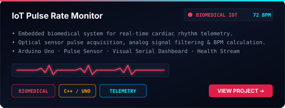
      </a>
    </td>
    <td width="50%" valign="top">
      <a href="https://github.com/Gnanendra942/Problem-solving-and-testing-S2-2">
        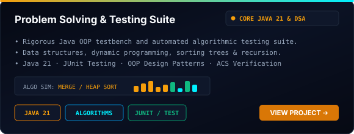
      </a>
    </td>
  </tr>
</table>

 

<!-- Special Feature: Tamil Nadu Tourism Platform -->
<table width="100%">
  <tr>
    <td width="100%" valign="top">
      

        <h3>🏛️ Tamil Nadu Tourism — Interactive Discovery Platform</h3>
        

          A high-performance editorial web portal engineered with <b>60 FPS fluid micro-interactions</b>, <b>zero external runtime dependencies</b>, an <b>algorithmic dynamic tour planner</b>, and an interactive geographic vector directory covering 12 living heritage, coastal, hill station, and temple circuits.
        

        

          
          &nbsp;
          
          &nbsp;
          
          &nbsp;
          
        

      

    </td>
  </tr>
</table>

 

<!-- ============================================================================== -->
<!-- 05. GITHUB ANALYTICS & SYSTEM STATE -->
<!-- ============================================================================== -->

## 📊 GitHub Analytics & System State

<!-- Dynamic Animated Status Badge -->

  

<!-- 2x2 Bento Analytics Grid -->
<table width="100%">
  <tr>
    <td width="50%" valign="top">
      
    </td>
    <td width="50%" valign="top">
      
    </td>
  </tr>
  <tr>
    <td width="50%" valign="top">
      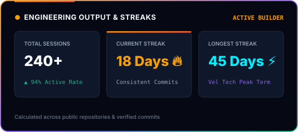
    </td>
    <td width="50%" valign="top">
      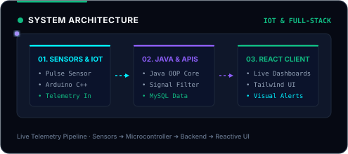
    </td>
  </tr>
</table>

 

<!-- Contribution Snake -->

 

<!-- ============================================================================== -->
<!-- 06. ACHIEVEMENTS, TROPHIES & GRAPH -->
<!-- ============================================================================== -->

## 🏆 Trophies & Activity Graph

<!-- Animated Trophies Card -->

  

<!-- Animated Contribution Velocity Graph -->

 

<!-- ============================================================================== -->
<!-- 07. CONNECT & FOOTER -->
<!-- ============================================================================== -->

## 📬 Let's Connect

I am actively seeking software engineering internships, open-source collaborations, full-stack web roles, and IoT embedded research opportunities. Let’s build something impactful together.

 

  
  &nbsp;
  
  &nbsp;
  

 

> ⚡ *"Simplicity and precision in code; resilience, speed, and elegance in architecture."*

 

<!-- Animated Cyber Footer -->

