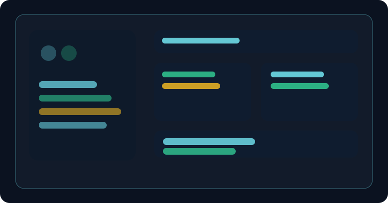
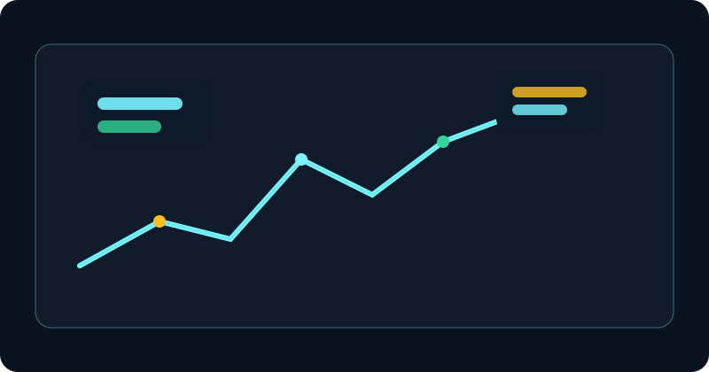
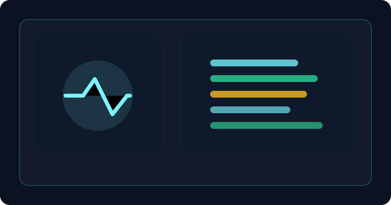
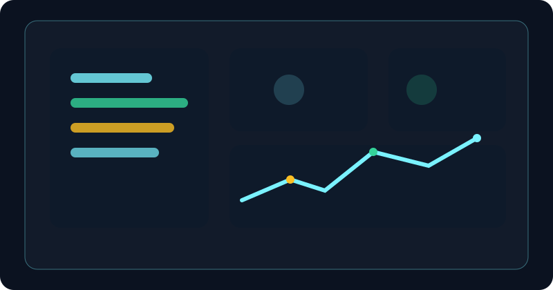

  

  

  
  
  

  
  
  
  

  

 

## About Me

I am <b>Chowreddygari Gnanendra Reddy</b>, a Computer Science Engineer and software developer focused on building reliable, user-centric digital products. I graduated in 2024 with a B.Tech in Computer Science from <b>Vel Tech, Chennai</b>, and I’m passionate about modern web applications, software engineering, product thinking, and solving real-world problems with clean code.

I enjoy exploring scalable frontend systems, backend logic, and AI-driven workflows while staying grounded in fundamentals like data structures, system design, debugging, and user experience. I’m especially interested in creating products that are practical, maintainable, and valuable to people.

I am currently learning and building in areas such as full-stack development, scalable UI architecture, cloud deployment, and AI-assisted workflows. I’m open to collaborations, internships, and software engineering opportunities where I can contribute with curiosity, discipline, and execution.

  
  

 

## Technical Skills

### Languages

### Frontend

### Backend

### Databases

### Cloud & DevOps

### Developer Tools

 

## Featured Projects

  <table>
    <tr>
      <td width="50%" valign="top">
        

          
          <h3>Women Entrepreneur Marketplace</h3>
          
A responsive digital commerce platform designed to help women-led businesses showcase and sell products while improving online visibility.

          
<strong>Stack:</strong> React, Node.js, Express, MongoDB

          

            
          

          

            <a href="https://github.com/Gnanendra942/women-marketplace" target="_blank">Repository</a> •
            <a href="https://example.com/demo-marketplace" target="_blank">Live Demo</a>
          

        

      </td>
      <td width="50%" valign="top">
        

          
          <h3>Road Safety & Accident Prevention</h3>
          
A data-driven safety solution focused on risky road conditions, accident prevention strategies, and awareness-driven traffic intelligence.

          
<strong>Stack:</strong> JavaScript, HTML, CSS, Analytics, Research

          

            
          

          

            <a href="https://github.com/Gnanendra942/road-safety-project" target="_blank">Repository</a> •
            <a href="https://example.com/demo-road-safety" target="_blank">Live Demo</a>
          

        

      </td>
    </tr>
    <tr>
      <td width="50%" valign="top">
        

          
          <h3>Pulse Rate Monitoring System</h3>
          
A health-tech prototype using sensor-driven monitoring to track pulse readings, visualize trends, and support real-time observation.

          
<strong>Stack:</strong> Arduino, Embedded Systems, Sensor Data

          

            
          

          

            <a href="https://github.com/Gnanendra942/pulse-rate-monitor" target="_blank">Repository</a> •
            <a href="https://example.com/demo-pulse" target="_blank">Live Demo</a>
          

        

      </td>
      <td width="50%" valign="top">
        

          
          <h3>Developer Portfolio Dashboard</h3>
          
A polished portfolio dashboard concept with analytics, project snapshots, performance highlights, and a professional UI focused on clarity and conversion.

          
<strong>Stack:</strong> React, Tailwind CSS, Charts, UI Design

          

            
          

          

            <a href="https://github.com/Gnanendra942/portfolio-dashboard" target="_blank">Repository</a> •
            <a href="https://example.com/demo-dashboard" target="_blank">Live Demo</a>
          

        

      </td>
    </tr>
  </table>

 

## GitHub Statistics

  
  

  

<h3 align="center">Contribution Streak</h3>

  

<h3 align="center">Activity Graph</h3>

  

<h3 align="center">Contribution Snake</h3>

  

 

## Certifications & Achievements

  <table>
    <tr>
      <td width="33%">
        

          <h4>Computer Science Graduate</h4>
          
B.Tech CSE — Vel Tech, Chennai

        

      </td>
      <td width="33%">
        

          <h4>Project Experience</h4>
          
Road safety, health monitoring, and marketplace apps

        

      </td>
      <td width="33%">
        

          <h4>Problem Solving</h4>
          
Focused on logic, debugging, and product-oriented engineering

        

      </td>
    </tr>
  </table>

 

## Education

  <table>
    <tr>
      <td width="50%" valign="top">
        

          <h3>Vel Tech, Chennai</h3>
          
<strong>B.Tech in Computer Science Engineering</strong>

          
Class of 2024

        

      </td>
      <td width="50%" valign="top">
        

          <h3>Learning Focus</h3>
          
Full-stack development, AI workflows, clean architecture, product building.

        

      </td>
    </tr>
  </table>

 

## Contact & Social Links

  
  
  
  

  

  

  

  <i>Last updated: 2026-08-30</i>

